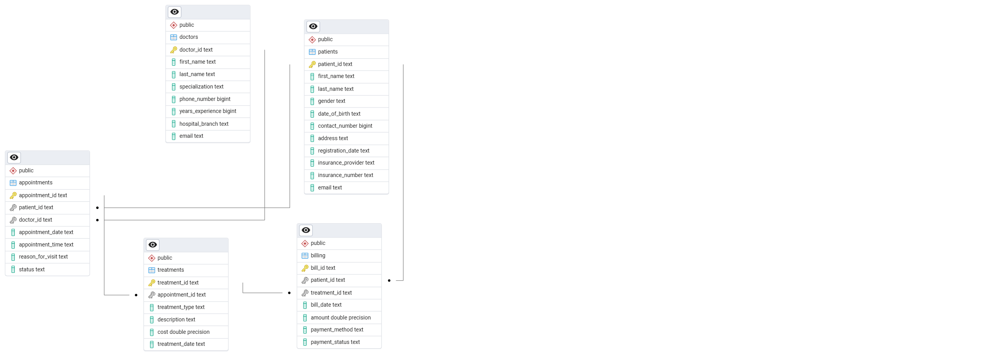

# Company Overview
**Company Name**: Dystopia  
Welcome to Dystopia, where we’re shaking up the grocery world with smart analytics! We’re a retail analytics firm helping grocery stores navigate a tough, fast-paced market. Our mission? Use data to make stores run smoother, keep customers happy, and boost profits, even when supply chains and shopping habits are unpredictable.

## Project Description
This project dives into the **Grocery Sales Database**, a dataset packed with info on sales, customers, products, and employees across our grocery store network. With seven linked tables (`categories`, `cities`, `countries`, `customers`, `employees`, `products`, `sales`), we’re analyzing everything from what’s flying off the shelves to who’s making it happen. Here’s why we’re doing it:

- **Smarter Sales**: Find the hottest products and categories to focus our stock and marketing, especially when resources are tight.
- **Know Our Shoppers**: Track how often people buy, what they spend, and where they’re from to offer deals that keep them coming back.
- **Empower Our Team**: Check how our salespeople are doing to improve training and make our stores run like clockwork.
- **Spot Regional Trends**: See which cities and countries are driving sales to tailor our strategies locally.
- **Keep Products Safe**: Monitor things like allergens and shelf life to meet customer needs and stay compliant in a health-conscious world.

We’re running analytics like:
- **Sales Trends**: Catching peak sales months to plan better.
- **Top Products**: Ranking items by revenue to stock what sells.
- **Customer Insights**: Finding our loyal shoppers for targeted promotions.
- **Regional Breakdowns**: Comparing sales by location to use resources wisely.
- **Team Performance**: Seeing who’s bringing in the most sales to reward and train effectively.

These insights help Dystopia’s stores stay ahead in a challenging retail world.

## Screenshot
*Visualizations are on the way! We’ll share a dashboard screenshot soon.*  


## How to Run the Project
1. **What You’ll Need**:
   - PostgreSQL (running on port 5432).
   - Python 3.12 with `pandas`, `sqlalchemy`, and `psycopg2-binary`.
   - Grocery Sales Database CSV files (download from Kaggle: https://www.kaggle.com/datasets/andrexibiza/grocery-sales-dataset).
   - Apache Superset (for future visualizations).

2. **Setup Steps**:
   - Clone the repo: `git clone https://github.com/Zikaal/dystopia.git``
   - Install dependencies: `pip install -r requirements.txt`
   - Load data: `python load_to_postgres.py`
   - Run queries: `python main.py`
   - *Superset setup will be added later.*

3. **Project Structure**:
```plaintext
├── data/
│   ├── categories.csv
│   ├── cities.csv
│   ├── countries.csv
│   ├── customers.csv
│   ├── employees.csv
│   ├── products.csv
│   └── sales.csv
├── images/
│   ├── placeholder.png
│   └── er_diagram.png
├── load_to_postgres.py
├── main.py
├── queries.sql
├── requirements.txt
└── README.md
```


## Tools and Resources
- **Database**: PostgreSQL
- **Programming**: Python 3.12 (`pandas`, `sqlalchemy`, `psycopg2-binary`)
- **Visualization**: Apache Superset (to be configured)
- **Data Source**: Grocery Sales Database (Kaggle)
- **Version Control**: Git, GitHub

## ER Diagram

